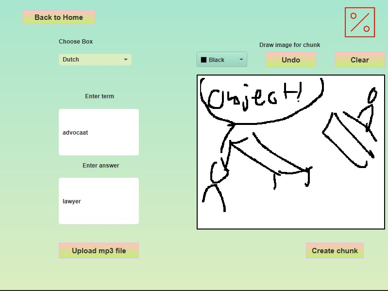

    

## Purpose & Benefits

ChunkR is a lightweight JavaFX desktop application aimed to help you learn a language of your choice.
It is based on a variant of the [Leitner System](https://en.wikipedia.org/wiki/Leitner_system) where there exists 7 levels of which you practice according to a schedule:

All new terms are added to level 1, and each day the goal is to add 15-30 terms. Once terms have been added, you practice according to the above schedule (handled within the app for you!).
Terms you know, progress to the next level. Terms you don't know, go back to level 1. This ensures that terms you want to learn will be encoded into your memory forever.

## Core features

1. Create a box for your language: 
2. Create chunks (terms) you want to practice, upload audio file for pronounciation and draw a picture to help you remember better:  
3. Practice! 
  

## Requirements

Java 19.0.0 & Maven 4.0.0

## Usage

Run within IDE of choice or in the directory where pom.xml is located with 'mvn javafx:run'